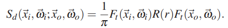

# GfxLab - Subsurface scattering

## Opis
- Ovo je fork originalnog GfxLab-a sa namerom dodavanja subsurface scattering-a

## Nameštanje

- Uključite JAR fajlove iz lib foldera u projekat, ako se to ne desi automatski.
- Potrebno je da vaš projekat koristi JavaFX biblioteke za vaš OS.
  - Najlakši način da to namestite je da koristite BellSoft Liberica JDK, koji, za razliku od većine drugih JDK-ova, dolazi sa ugrađenim JavaFX modulima.
    - Ako koristite IntelliJ, ovo je lako namestiti: File > Project Structure... > Project > SDK > Add SDK > Download JDK... > Vendor: BellSoft Liberica JDK 19.0.1.
    - Alternativno, sami preuzmite JDK sa [https://bell-sw.com/pages/downloads/](https://bell-sw.com/pages/downloads/#/java-19-current). Izaberite vaš OS, poslednju verziju, i Full JDK (jedino Full JDK uključuje JavaFX). Kada instalirate/raspakujete JDK, namestite u IDE-u da projekat koristi baš taj JDK.
  - Ako nećete da koristite BellSoft Liberica JDK, snađite se da preuzmete odgovarajuće biblioteke na neki način (direktni download svih potrebnih jar-fajlova, Maven, ...). Potrebni su vam javafx-base, javafx-controls, javafx-graphics, i javafx-swing.
  - U nekim slučajevima JavaFX neće koristiti GPU za iscrtavanje interfejsa i sve će biti pomalo laggy (meni se to dešava uz Linux i integrisani GPU). U tom slučaju (a ni inače verovatno ne može da škodi), dodajte system property `prism.forceGPU = true`, npr. kroz VM argument `-Dprism.forceGPU=true`.
  

## Šta-gde

- Pokrećete klasu `gui.App`.
- Nameštate šta želite da prikažete u klasi `playground.GfxLab`.
- Sve što budemo razvijali u toku kursa biće u paketu `graphics3d`.

## Ideja iza subsurface scattering-a
Subsurface scattering predstavlja prelamanje zraka svetlosti kada zađe pod površinu materijala i raspršuje se unutra dok ne izadje na površinu.

Ovaj fenomen se može simulirati direktno sa praćenjem zraka ispod površine dok on ne izadje i praćenjem nadalje ili se može aproksimirati.
Pošto je simulacija jako zahtevna ja sam se odlučio da koristim aproksimaciju koja je izneta u radu [1]. 

Jako pojednostavljeno, ideja ove aproksimacije je da izaberemo neku tačku u blizini pogođen tačke koja će nam biti izlazna tačka našeg zraka iz materijala.
Potom na osnovu određene formule i dolaznog svetla u toj tački odredimo doprinos subsurface scattering na izlaznu svetlost.

Tu tačku izlaznog zraka ćemo birati nasumično u disku poluprečnika Rmax oko naše ulazne tačke.

## Opis subsurface scattering implementacije

### Klasa BSSSDF

Većina logike se nalazi u BSSSDF klasi. Promenjive u toj klasi su nazvane na osnovu sledeće liste iz rada [1]. Svaka promenjiva je imenovana u komentaru na vrhu klase

Statičke inicijalne vrednosti su takođe izvučene iz istog rada i naredne tabele

Ova klasa ima 3 konstruktora jedan bez parametara koji samo služi da bi stari materijali mogli normalno da rade i postavlja bsssdf na absorbtive to jest da uvek vraća Vec3.ZERO za vektore.
Drugi koji prima sigmaA, sigmaS, eta i g pa pomocu sigmaS i g izračuna sigmaSPrime(Redukovani koeficijent ekstinkcije) i sa njime poziva poslednji konsturktor.
Treći konstruktor izračunava ostale promenjive na osnovu njihovih definicija datih u radovima [1] i [5]. 

Fdr se racuna u odvojenoj metodi na osnovu aproksimacije date u petom poglavlju rada [5] tačnije u podnaslovu 5.3.4.
Definicije za zr i zv  takođe potiču iz rada [5].

Funkcija sample vraca rezultat koji sadrzi dve tačke potrebne za ispaljivanje zraka koji će dati izlaznu tačku u preseku sa našim objektom.
Ova funkcija na početku nasumično bira dužinu r i ugao phi gausijanskom raspodelom. 
Logika za biranje tačke na disku je ista kao i u Sampler::randomInDisk(double r) ali sam je izvukao napolje jer mi je bilo lakše da radim sa r i phi nego sa vektorom.
Potom koristimo novu funkciju rotateAroundVector(Implementaciju sam našao u knjizi sa referencom [6]) koja rotira neku tačku oko prave odredjene dvema tačkama. 
Tačku za rotiranje dobijamo kao rejekciju ulaznog zraka u odnosu na normalu. Tako dobijena tačka bi trebalo da sa tačkom p daje vektor normalan na normalu našeg objekta.
Trebalo bi da kad god iz neke druge tačke pogodimo našu istu da ćemo dobiti istu tačku za rotaciju pa ne bi trebalo to da uvodi bias.
Posle rotacije normalizujemo na dužinu r da bi smo dobili našu početnu tačku. Krajnju tačku zraka dobijamo tako što dodamo p na početnu tačku.
Potom vratimo te dve tačke.

Funkcija rd izračunava Rd na razdaljini d po sledećoj formuli iz rada [5] peto poglavlje peti podnaslov:

### Promene u PathTracer klasi
U originalnoj klasi su napravljene dve promene i dodat je jedan novi metod.

Novi metod fresnelDielectric računa fresnel transmitance na osnovu Fresnelove jednačine za dielektrične materijale.

Funkcija radiance sada ima dva overloaded metoda jedan koji se poziva sa istim parametrima kao i stari i jedan koji prima i parametar tipa Hit.
Prvi samo odredi Hit i pozove drugi sa podacima o tom pogodku tačnije to je samo prvi deo starog metoda izdvojen u novi.
Drugi metod sadrži ostatak starog metoda i još jedan deo koji rešava subsurface scattering zbog kog su i razdvojeni.
Stari deo metoda je isti tako da ćemo odmah preći na novi deo:

- Pozivamo funkciju sample iz bsssdf klase pogođenog materijala koja nam vraća dve tačke za novi zrak
- Izračunavamo fresnel transmitance u tački koju smo pogodili
- Ispaljujemo novi zrak 
- Kupimo prvi pogodak tog zraka
- Proveravamo da li smo išta pogodili i ako jesmo da li smo pogodili isti objekat ako nismo preskačemo i vraćamo rezultat a ako jesmo računamo doprinos
  - Izračunamo ulazni smer i normalu za novi pogodak
  - Koristeći funkciju distanceSquared izračunamo kvadratnu razdaljinu izmedju tačke originalnog pogodka i ovog sada
  - Izračunamo fresnel transmitance u tački novog pogodka
  - Pozovemo funkciju radiance sa podacima o novom pogodku da bi izračunali doprinos koji dobijamo posle ispaljivanja tog zraka
  - Izračunamo uticaj subsurface scateringa na osnovu sledeće formule(bidirectional scattering surface distribution function) iz rada [5] peto poglavlje podnaslov jedan:
  
  
  - Potom pomnožimo doprinos ispaljenog zraka sa uticajem subsurface scateringa
  - Na kraju to dodamo na rezultat

## Krajnji rezultat
### Bez BSSSDF-a

### Sa BSSSDF-om

## Literatura
[1]: Henrik Wann Jensen, Stephen R. Marschner, Marc Levoy, Pat Hanrahan, [A Practical Model for Subsurface Light Transport](http://www.graphics.stanford.edu/papers/bssrdf/bssrdf.pdf)

[2]: Matt Jen-Yuan Chiang, Peter Kutz, Brent Burley, [Practical and Controllable Subsurface Scattering for Production Path Tracing](https://media.disneyanimation.com/uploads/production/publication_asset/153/asset/siggraph2016SSS.pdf)

[3]: Per H. Christensen, Brent Burley, [Approximate Reflectance Profiles for Efficient Subsurface Scattering](https://graphics.pixar.com/library/ApproxBSSRDF/paper.pdf)

[4]: Ian King, Christopher Kulla, Iejandro Conty, Marcos Fajardo [BSSRDF Importance Sampling](https://www.imageworks.com/sites/default/files/2023-10/BSSRDF-importance-sampling-imageworks-library-BSSRDF-sampling.pdf)

[5]: Craig Steven Donner, [Towards Realistic Image Synthesis of Scattering Materials](https://www.cs.jhu.edu/~misha/Fall11/Donner.Thesis.pdf), 2006

[6]: Dragan Mašulović, Analitička Geometrija za informatičare, Novi Sad, 2019.

